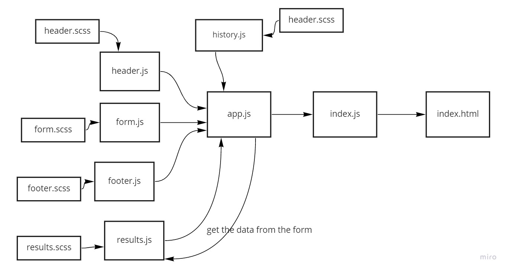
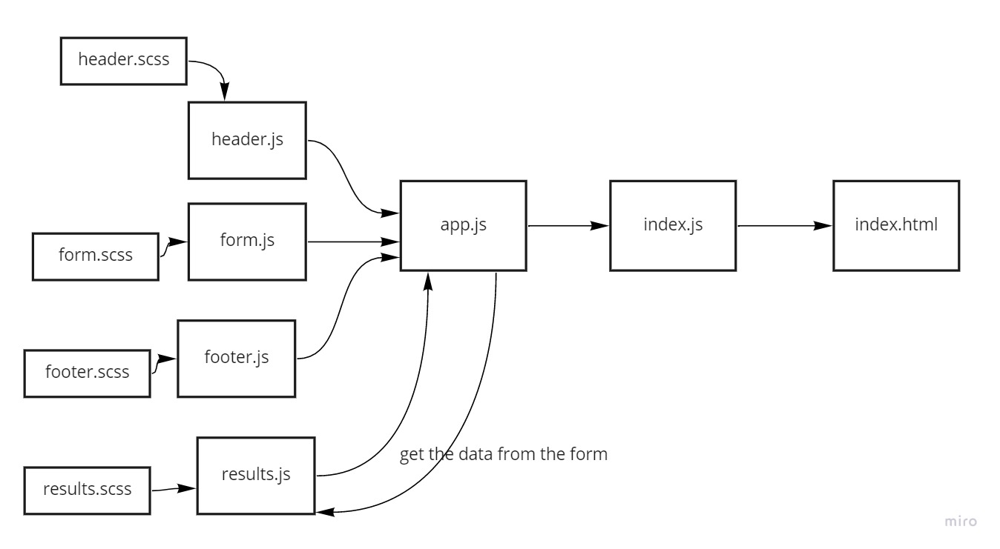

# reesty

## lab 28

[deployed](https://main--jolly-saha-1eeaf6.netlify.app)

## lab 27

[deployed](https://main--jolly-saha-1eeaf6.netlify.app)

## lab 26

to run the code enter inside directory resty

cd resty

then

npm start

then

open localhost in browser

[more information about create react app](README1.md)
